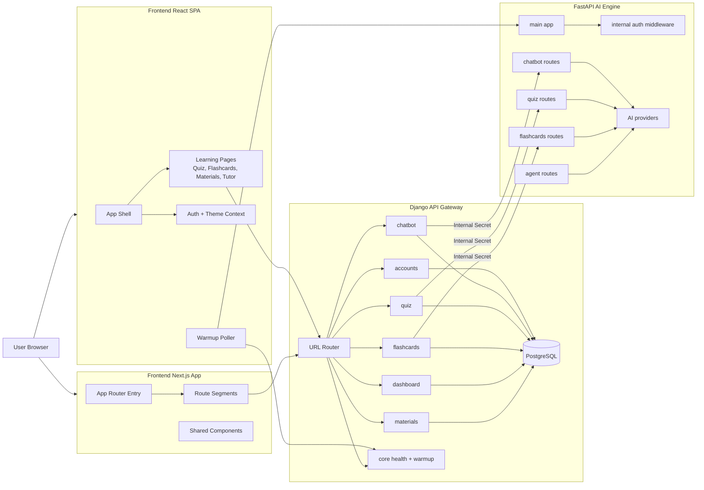

# Graphify Architecture Guide

This document explains what Graphify revealed about the Lamla system, how to interpret the graph outputs, and how to rerun the process safely.

The previous version was a static snapshot. This version is intended to be a practical guide for engineers who need to understand system structure, confidence levels, and cross-service flow.

## Quick Start

Use these commands from the repository root for the standard segmented run:

```powershell
python -c "import graphify"
python -c "import json; from graphify.detect import detect; from pathlib import Path; print(json.dumps(detect(Path('.'))))"
```

Then run extraction per bounded area:

```powershell
# backend
python -c "from graphify.detect import detect; import json; from pathlib import Path; Path('.graphify_detect.json').write_text(json.dumps(detect(Path('backend'))), encoding='utf-16')"

# frontend
python -c "from graphify.detect import detect; import json; from pathlib import Path; Path('.graphify_detect.json').write_text(json.dumps(detect(Path('frontend'))), encoding='utf-16')"

# ai_service
python -c "from graphify.detect import detect; import json; from pathlib import Path; Path('.graphify_detect.json').write_text(json.dumps(detect(Path('ai_service'))), encoding='utf-16')"
```

Expected deliverables for each target folder:

- graphify-out/<folder>/graph.html
- graphify-out/<folder>/GRAPH_REPORT.md
- graphify-out/<folder>/graph.json

## Why Graphify Was Run In Segments

Running Graphify on the full repository at once is possible, but not ideal for clear results because the corpus is large and mixed (backend, frontend, docs, images, generated artifacts).

The repository scan found:

- Total files scanned: 316
- Estimated corpus size: around 364,654 words
- Code files: 235
- Docs: 50
- Images: 31
- Sensitive files skipped: 5

Because this exceeded the large-corpus threshold, the graph was generated per bounded area:

- backend
- frontend
- ai_service

This separation makes community detection more meaningful and reports easier to audit.

## Big Picture Architecture

At runtime, Lamla is split into three active layers:

1. Frontend clients
2. Django backend as API gateway + system-of-record
3. FastAPI AI service for async AI workloads and tool orchestration

The key architectural decision is this boundary:

- Django owns authentication, persistence, and user-facing API composition.
- FastAPI owns AI provider interaction, structured generation, and agent-style tool orchestration.
- Calls from Django to FastAPI are internal and gated by shared-secret middleware.



## What The Three Graph Runs Revealed

### 1) Backend graph

Strongly connected core entities were:

- User
- QuizSession
- Deck
- Material
- ChatSession

Interpretation:

- Backend domain model is centered on user-linked learning state.
- Quiz, flashcards, materials, and chatbot all converge on user context.
- This is expected for a personalized learning platform, but it also means user-model changes have high blast radius.

Notable inferred bridges:

- Chat history endpoint to ChatSession model
- Async quiz flow to QuizSession model

Actionable takeaway:

- Keep tests around user identity/session flow strict, because it is the highest-centrality surface.

### 2) Frontend graph

Most central nodes were service-layer modules:

- services/api.js
- services/dashboard.js
- services/auth.js
- services/materials.js

Interpretation:

- Frontend coupling is service-centric rather than component-centric.
- API modules form the shared integration backbone across feature pages.

Actionable takeaway:

- If frontend regressions appear across multiple pages, inspect shared services first.

### 3) AI service graph

The dominant node was AIClient, followed by provider orchestration and APIIntegrationError.

Interpretation:

- The AI service is intentionally organized around one orchestration center.
- Quiz and flashcards routes are thin handlers around that center.
- Error normalization and provider fallback are core resilience mechanisms.

Actionable takeaway:

- Prioritize contract tests around AIClient and schema repair paths when changing providers or prompt formatting.

## Confidence Model: How To Read Edges Correctly

Graphify tags relationships with confidence classes:

- EXTRACTED: explicit relationship from source (most reliable)
- INFERRED: model-derived relationship (useful, but verify)
- AMBIGUOUS: uncertain candidate link (investigation prompt, not fact)

Practical rule:

- Treat EXTRACTED as architecture facts.
- Treat INFERRED as hypotheses for code review.
- Treat AMBIGUOUS as TODOs for graph refinement.

## Route Ownership And Boundary Contracts

### Django entry points

- /warmup/
- /health/
- /admin/
- /api/ mounted modules for chatbot, quiz, flashcards, accounts, dashboard, materials

### FastAPI entry points

- /chatbot
- /quiz
- /flashcards
- /agent
- /
- /health

Contract boundary:

- Django performs user auth and persistence.
- FastAPI executes AI-heavy operations and tool calls.
- Internal headers/secret are required for Django to call FastAPI protected routes.

## Output Files And How To Use Them

Each run produces three primary artifacts:

- graph.html: interactive exploration in browser
- graph.json: machine-readable graph for downstream analysis
- GRAPH_REPORT.md: human summary with god nodes, surprises, questions

Generated paths:

- graphify-out/backend/
- graphify-out/frontend/
- graphify-out/ai_service/

Recommended workflow:

1. Open graph.html for topology overview.
2. Read GRAPH_REPORT.md for prioritized investigation leads.
3. Validate high-impact INFERRED links in code before making architecture changes.

## Security And Commit Policy

Short answer: generated Graphify output should usually not be pushed to production branches.

Reason:

- graph.json and GRAPH_REPORT.md can expose internal architecture and inferred relationships.
- Extracted text can include implementation details from logs/docs that were not meant for distribution.
- Local helper files may leak absolute machine paths and local environment details.

Recommended policy:

- Keep only curated architecture docs in docs/ under version control.
- Ignore transient Graphify artifacts and machine-local files.
- If you intentionally publish a graph report, manually redact sensitive nodes/edges first.

## Known Caveats In Current Run

- Backend run produced extraction warnings for some semantic nodes missing expected fields.
- Final backend graph still completed and rendered, but semantic edge quality may be uneven in a subset of nodes.

If this recurs, rerun backend with stricter chunk prompts and schema validation before merge.

## Repeatable Runbook For Future Updates

Use this when architecture changes meaningfully:

1. Detect corpus size first.
2. If large, run by domain folder rather than whole repo.
3. Run AST extraction for structural links.
4. Run semantic extraction in chunks.
5. Merge and regenerate report + HTML.
6. Review only the top high-betweenness and high-degree nodes first.

For incremental updates:

- Prefer update mode on the changed subtree.
- Re-check only impacted communities instead of re-reading full reports.

## Suggested Next Documentation Enhancements

- Add a small section per bounded context with "what breaks if this changes".
- Add a maintained list of validated INFERRED links (promoted to accepted architecture knowledge).
- Add versioned graph snapshots (date + commit hash) for architecture drift tracking.
